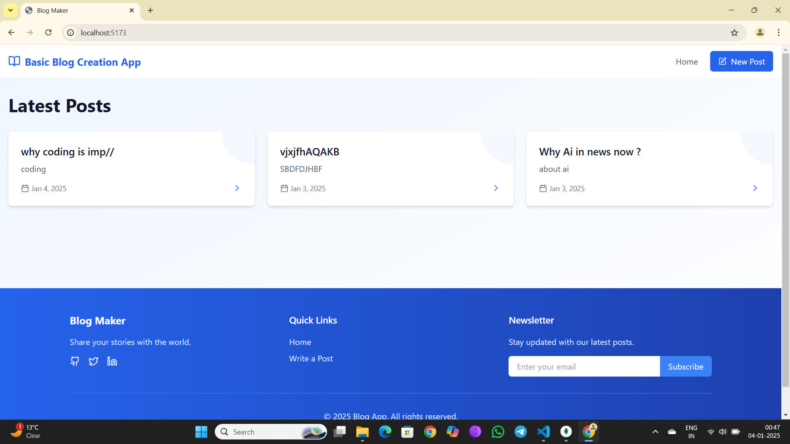
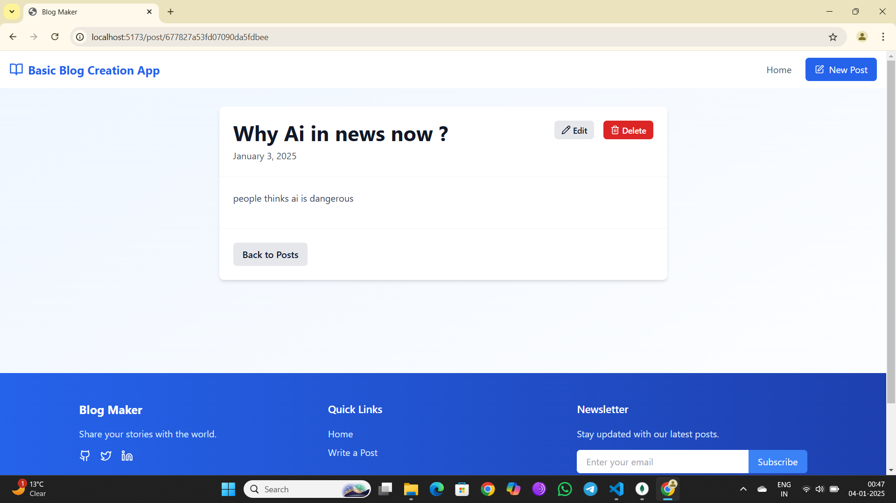
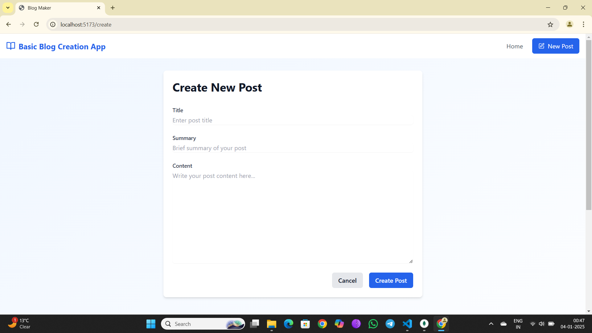
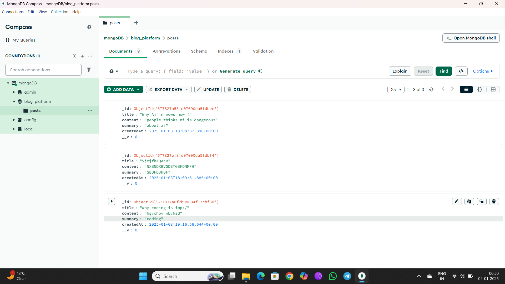
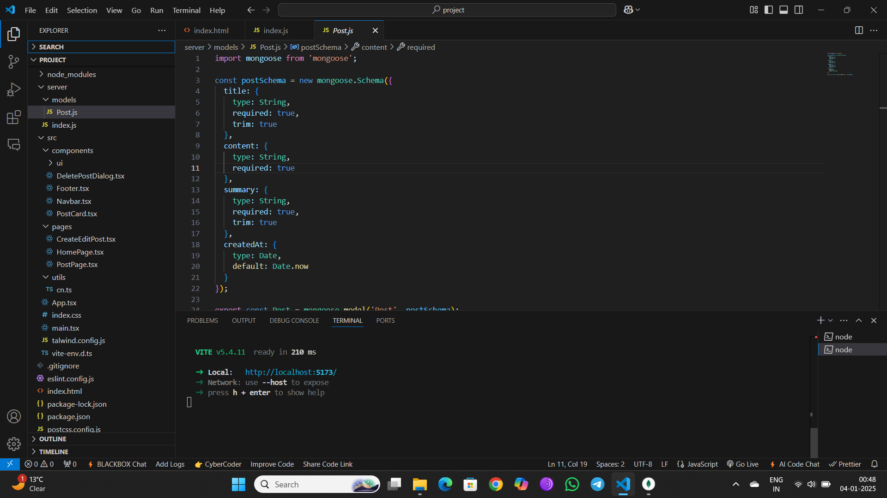

# Blog Maker Platform

A modern, user-friendly platform for creating and managing blogs with a clean and intuitive interface.

## Links
- Youtube <a href="https://youtu.be/-PAmVvEjkaE" target="_blank">Live Video</a>
- versel <a href="https://basic-blog-creation-platform.vercel.app/" target="_blank">Live Site</a>

## Features

- Rich text editor with markdown support
- Edit
- Delete
- Create


## UI Samples

### Dashboard

*Main dashboard interface with analytics and post management*

### Editor Interface
 <br>
 <br>
 <br>

*Rich text editor with formatting tools*


## Installation

```bash
npm install blog-maker
npm run setup
npm start
```
-- Thanks --